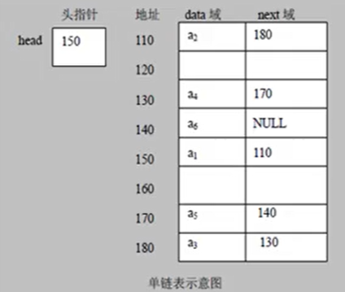

### 链表

- 链表是以结点的方式来存储的，结点 = data域 + next域，data用来存储数据，next用来指向下一个结点的位置
- 链表中的各个结点不一定是连续的
- 链表还分为带头结点的链表和不带结点的链表（根据实际需求）
- 链表最后一个节点的next是null




#### 链表反转

**单链表反转的思路**

- 先新创建一个结果链表的头节点，用于连接原链表中的节点
- 遍历原链表，将指向的节点取下来，连接到结果链表的头指针处

算法中一个很重要的地方就是建立了一个指针，用于指向在遍历单链表的过程中当前节点的下一个节点，算法的核心就是下面的这段代码

```java
        // 遍历原来的链表，每遍历一个节点，就将其取出，并放在新的链表的最前端
        while (cur != null) {
            next = cur.next;   // 先保存当前节点的下一个节点
            cur.next = reverseHead.next;   // 先断开链
            reverseHead.next = cur;   // 将链连接
            cur = next;   // 移动cur
        }
```

`cur`指向当前节点，`next`指向当前节点的下一个节点，`reverseHead`表示反转链表的头结点

- `next = cur.next`表示`next`始终指向`cur`的后一个结点
- `cur.next = reverseHead.next;`表示断开`cur`指向`next`的这条链，让`cur`指向`reverseHead.next`，也就是指向上一次加入到`reverseHead`后面的那个节点，即这里就实现了一半的反转
- `reverseHead.next = cur`，让反转链表的头结点始终指向遍历链表的当前链表
- `cur = next`移动指针


#### 链表合并

```java
/**
 * 合并两个有序的链表
 * */
public HeroNode mergeList(HeroNode head1,HeroNode head2) {
    if (head1.next == null && head2.next == null) {
        return null;
    }else if (head1.next == null) {
        return head2;
    }else if (head2.next == null) {
        return head1;
    }
    HeroNode res = new HeroNode(0,"","");   // 合并后链表的头结点
    HeroNode cur = res;
    System.out.println("即将进入循环");
    while (head1.next != null && head2.next != null) {
        if (head1.next.no <= head2.next.no) {
            HeroNode temp = head1.next;
            cur.next = temp;
            head1 = head1.next;
        }else {
            HeroNode temp = head2.next;
            cur.next = temp;
            head2 = head2.next;
        }
        cur = cur.next;    // 一定要注意cur也要往后走一步
    }
    System.out.println("我能出循环");
    /**
     * 看看谁先走完，head1先走完，后面的都是head2的
     */
    if (head1.next == null) {   
        cur.next = head2;
    }
    if (head2.next == null) {
        cur.next = head1;
    }
    return res;
}
```


### 双链表

双链表的操作和单链表很相似，就是比单链表多了一个前驱结点


### 约瑟夫环问题（单向环形链表）

问题描述：设编号为1，2，...，n的n个人围坐一圈，约定编号为k的人从1开始报数，数到m的那个人出列，他的下一位又从1开始报数，数到m的人出列，依此类推，直到这些人全部出列为止，由此产生一个出队编号序列。

```java
/**
 *
 * @param startId 从startId开始数数
 * @param countNum 数到countNum的小孩出圈
 * @param nums 共有nums个小孩
 */
public void Josephu(int startId, int countNum, int nums) {
    // 先对数据进行校验
    if (startId < 0 || startId > nums || countNum > nums) {
        System.out.println("输入的数据不合法~~~");
        return;
    }
    // 创建辅助指针，帮助完成小孩出圈
    Boy helper = first;  // first最开始指向的是编号为1的小孩
    while (true) {
        if (helper.getNext() == first) {  // 让helper指向单项环形链表的最后一个节点
            break;
        }
        helper = helper.getNext();
    }
    // 小孩报数之前，先让first和helper同时移动k-1次
    for (int i = 0; i < startId-1; i++) {
        first = first.getNext();
        helper = helper.getNext();
    }
    while (true) {
        if (helper == first) {  // 此时只有一个节点了
            break;
        }
        // 当小孩报数时，first和helper需要同时移动m-1次
        for (int j = 0; j < countNum-1; j++) {
            first = first.getNext();
            helper = helper.getNext();
        }
        // 令first指向的节点出圈
        System.out.printf("此时%d号小孩出圈\n",first.getId());
        first = first.getNext();
        helper.setNext(first);
    }
    System.out.printf("最后留在圈中的小号编号是%d\n",first.getId());
}
```


解题思路

1. 首先确定约瑟夫问题可以使用单向环形链表解决

2. 在这个环形链表中有两个指针，first和helper

   1. first指向的是第一个报数的小孩
   2. helper指向的是第一个报数小孩的后一个小孩

3. 因为first最开始指向的是编号为1的小孩，但是这个小孩却不一定是第一个报数的小孩，因此first和helper都需要被移动k-1次

   比如，题目要求是让编号为4的小孩先报数（即k=4），而此时first指向的是编号为1的小孩，所以需要移动k-1=3次

4. 根据题目的要求，比如让报数为2的小孩出圈（m=2），所以此时first和helper需要移动m-1=1次，因为当前指向的小孩会先报一次数1

5. 小孩出队列可以有两种写法

   1. ```java
      helper.next = first.next;
      first.next = null;
      ```

      **这样是断了`first`的前后两条链，但是有一个致命的缺陷就是`first`指针消失了，因此不能使用这种方法**

   2. ```java
      first = first.next;
      helper.next = first;
      ```

      **这样很显然是只断开了一条链，但是`first`上一次指向的节点因为没有了引用，也将会被`java`的垃圾回收自动收集掉，因此也是可行的**

   

