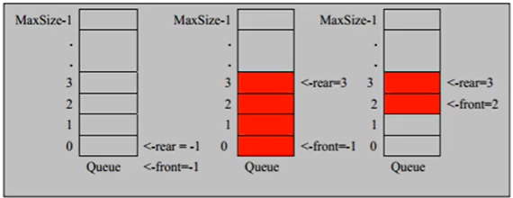

### 队列

队列是一个有序的列表，可以用数组或是链表实现，遵循先入先出的原则，从**队尾插入数据，从队首取出数据**

数组模拟队列的思路

- `MaxSize`表示队列的最大容量（`MaxSize-1`的原因是下标是从0开始的）
- 因为队列的输出、输入分别是从前后端执行的，因此需要两个下标front、rear分别记录队列的前后端
  - front随着数据的输出而移动
  - rear随着数据的输入而移动
  - front和rear的初始值都是-1，但是front的意义是指向的是队列头数据的前一个位置，而rear指向的是队尾的元素
- 队列为空的条件  `front == rear`
- 队列为满的条件 `rear == MaxSize - 1`

**虽然按照上面的思路能够使用数据模拟出队列的效果，但是正如图中最右侧（第2张图的第3个）显示的那样，当front和rear指针上移之后，即使前面的数据已经被去除，但是前面空余空间是不能够使用**，**也就是说，目前数组只能使用一次**

==**解决方案：取模 % ，创建环形队列**==

数组模拟成环形队列的思路

- 首先调整front指针的含义：front 指向队列的第一个元素（而不是第一个元素的前一个位置），也就是`arr[front]`代表的就是第一个元素，front 的初始值是 0 
- 然后调整rear指针的含义：rear 指向队列最后一个元素的下一个位置（而不是最后一个元素的位置），因为我希望留出一个空间作为约定，rear 的初始值是 0
- 当队列满时，条件是 `(rear + 1) % maxSize == front`
- 当队列为空时，条件是`rear == front`
- 队列中有效数据的个数是 `(rear - front + maxSize) % maxSize`            