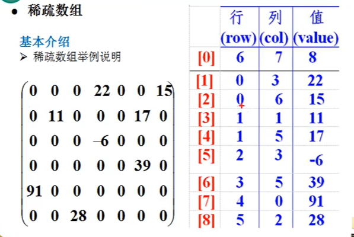

### 稀疏数组

当一个数组中大部分的值为0，或者为同一个值的数组时，可以使用稀疏数组来保存该数组

稀疏数组的处理方法是：

- 记录数组一共有几行几列，有多少个不同的值
- 把具有不同值的元素的行列及值记录在一个小规模的数组中，从而缩小程序的规模

 相互转换的思路

二维数组转换稀疏数组的思路

- 首先，遍历数组，得到其中有效数据的个数sum
- 根据sum，便可以创建出稀疏矩阵，`sparseArray[sum+1][3]`

- 将二维数组的有效数据插入到稀疏数组中

稀疏数组转化二维数组的思路

- 首先读取稀疏数组的第一行，根据第一行的数据恢复二维数组
- 在读取稀疏数组的后面行，并按照数据赋给二维数组即可

数据磁盘`I/O`的写法

- `new File("文件名")`，如果存在这个文件那么就写入这个文件，不存在的话就创建
- `FileWriter`类从 `OutputStreamWriter` 类继承而来。**该类按字符向流中写入数据**，创建该类的对象需要提供想要写入的文件名称
- 为了提高字符流读写的效率，引入了**缓冲机制**，进行字符批量的读写，提高了单个字符读写的效率。`BufferedReader`用于加快读取字符的速度，`BufferedWriter`用于加快写入的速度
  - `BufferedReader`和`BufferedWriter`类各拥有8192个字符的缓冲区。当`BufferedReader`在读取文本文件时，会先尽量从文件中读入字符数据并放满缓冲区，而之后若使用read()方法，会先从缓冲区中进行读取。如果缓冲区数据不足，才会再从文件中读取，使用`BufferedWriter`时，写入的数据并不会先输出到目的地，而是先存储至缓冲区中。如果缓冲区中的数据满了，才会一次对目的地进行写出

可以仔细观察代码的写法，无论是读还是写，都是一个字符一个字符的进行的。

